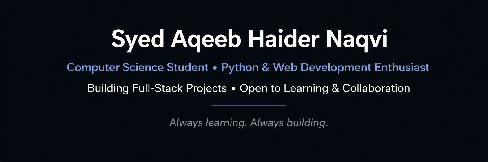

  

 💫 About Me:
 Hi, I'm Syed Aqeeb Haider Naqvi👋  I'm a Computer Science student passionate about software development and continuous learning. I enjoy building practical projects, solving programming challenges, and improving my technical skills through hands-on experience.   💻 Technologies - Python - C++ - HTML - CSS - JavaScript - Git & GitHub   🌱 Currently Learning - Frontend Development - Full-Stack Web Development - Cloud Fundamentals - Modern Software Development Practices   🏆 Highlights - Successfully completed Stanford University's **Code in Place** program. - Completed Deloitte Australia **Cyber Job Simulation** on Forage. - Building projects to strengthen my software development skills.   🎯 Goals My goal is to become a skilled Software Engineer by building meaningful projects, learning from real-world challenges, and continuously improving my technical and problem-solving abilities.  **Always learning. Always building.**

## 🌐 Socials:
  

# 💻 Tech Stack:
       
# 📊 GitHub Stats:
 
 

